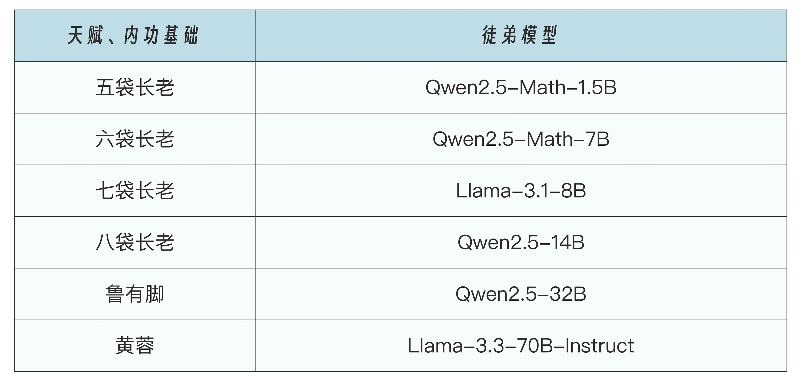
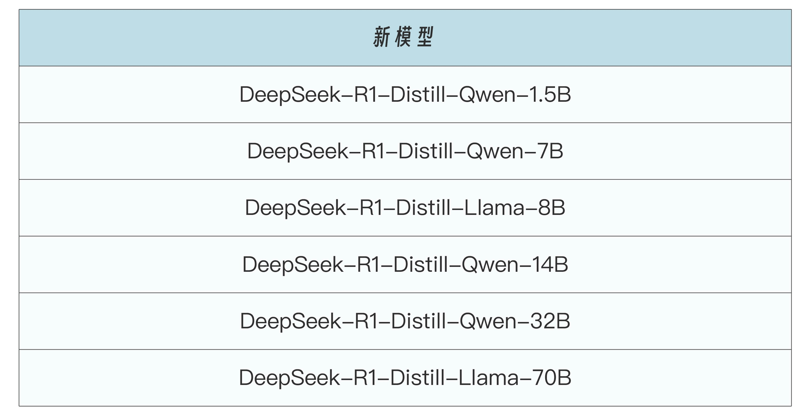

# 蒸馏是什么
## 白话蒸馏
在《射雕英雄传》中，洪七公是江湖上人人敬仰的北丐，武功高强，见识广博，内力深厚，就像大模型，经过了海量数据的训练，拥有强大的知识储备和计算能力。

洪七公总要收徒传艺，将丐帮武学传承下去。因此他需要将武功用“浓缩”的方式交给徒弟，在保证一定精度的同时，大幅降低对于内力（GPU）的要求，例如，他将打狗棒法传给了黄蓉，将降龙十八掌传给了郭靖等等，这便是模型蒸馏技术。

黄蓉等小模型，虽然武功不及洪七公，但是胜在没有洪七公这么大的江湖名望（部署和推理成本低），因此对付三流的沙通天、灵智上人之类的小卡拉米时，没有江湖前辈欺负后辈的心理包袱。

以 DeepSeek 发布的六个蒸馏模型为例，满血版 671B 参数量的 DeepSeek R1 就是洪七公，而洪七公针对不同尺寸的徒弟模型进行武功蒸馏，这些徒弟模型包括：



经过蒸馏后便得到了新模型:




洪七公教徒弟的方法，是他先演示一遍，然后让徒弟跟着模仿一遍。但洪七公不会让徒弟死记硬背，而是会交给他们思维方式，让他们自己感受内力的流动，做到招式随心而发。在模型蒸馏中，思维方式有一个专业名称，叫做**软标签**，软标签并不是直接告诉小模型“这是对的”，而是通过大模型的输出，给出每个类别的概率分布。小模型通过学习这些概率分布，能够理解不同类别之间的微妙区别。

徒弟们在拜入洪七公门下时，都有自己的武功根基，因此在学习洪七公的武功时，会有一些自己的想法，这被称之为**硬标签**。在实际蒸馏过程中，徒弟要尽可能学习师父的本领，但是又不能和自己原本的内功冲突，导致走火入魔。因此需要在软硬标签间寻找一个标准，得到标准后，进行反复训练，直到纯熟，此时徒弟就出师了。


```python
# 概念性代码示例
class KnowledgeDistillation:
    def __init__(self, teacher_model, student_model):
        self.teacher = teacher_model
        self.student = student_model
        
    def train(self, data):
        # 1. 教师模型生成软标签（soft labels）
        teacher_outputs = self.teacher(data)
        
        # 2. 学生模型生成预测
        student_outputs = self.student(data)
        
        # 3. 计算损失
        # 包含两部分：硬标签损失和软标签损失
        loss = (
            alpha * hard_label_loss(student_outputs, true_labels) +  # 硬标签损失
            (1 - alpha) * soft_label_loss(student_outputs, teacher_outputs)  # 软标签损失
        )
```