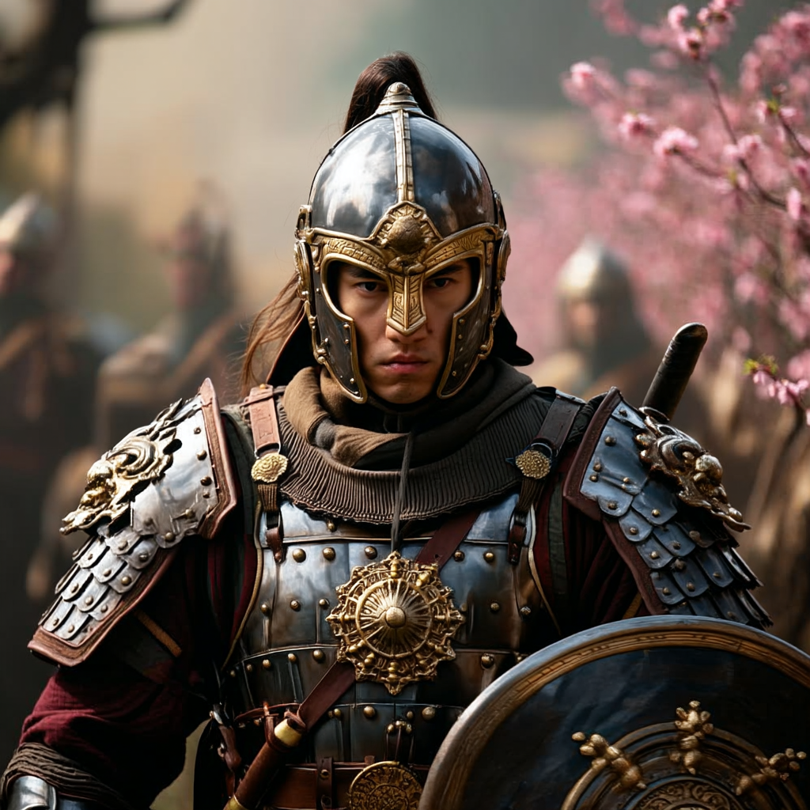
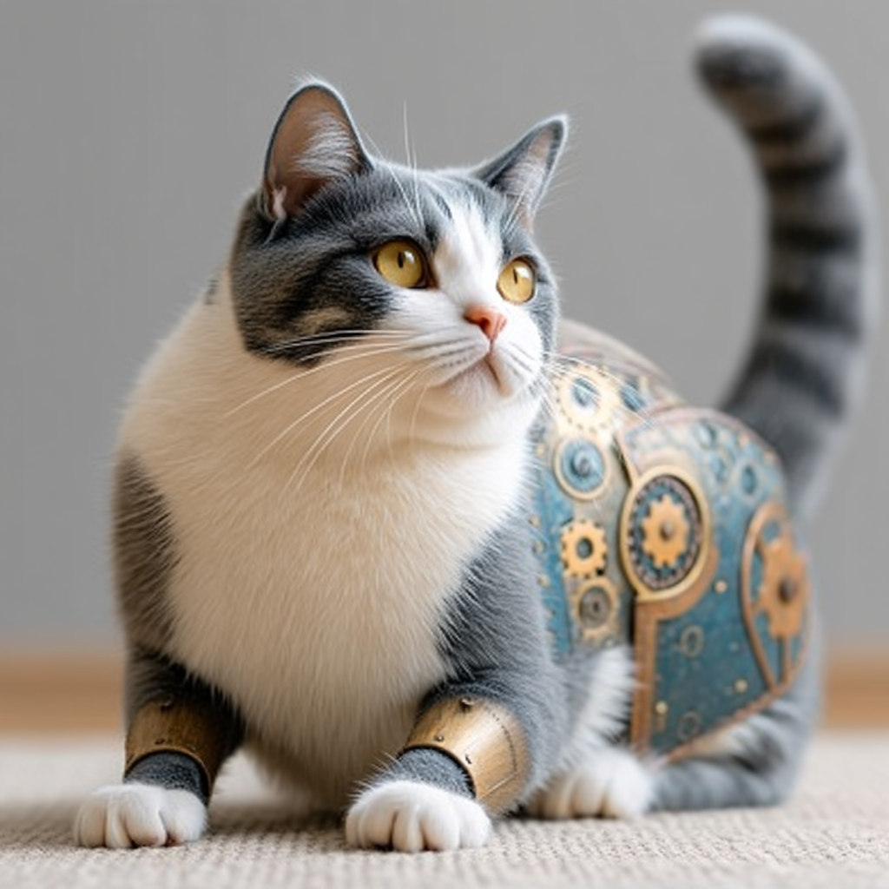

# oref
Omni-Reference（全向参考系统） 这是 V7 引入的核心功能，允许用户通过上传参考图像或提供 URL，将特定元素（如人物、物体、场景）直接嵌入生成的图像中。例如，用户可以上传一张角色设计图，让 AI 在生成新图像时严格保留该角色的特征。

oref 参数 即 Omni-Reference 的缩写，是该功能的命令参数。用户在输入提示词时：
- 通过 --oref [图片链接] 来指定参考图像
- 配合 --ow [权重值]（Omni-Weight）调整参考强度。

例如：
```
科幻城市夜景，未来感建筑 --oref [图片链接] --ow 400
```
其中 --ow 400 表示强约束，要求生成图像尽可能贴近参考图。

V7 的第七个主版本，于 2025 年 5 月正式发布。V7 以 “精准元素控制” 为核心卖点，除 Omni-Reference 外，还包括多维度风格混合、高分辨率渲染等升级。


---

## 多维度参考
- 元素级控制：可指定参考图像中的特定物体（如“手持宝剑的角色”），AI 会将其融入新场景，同时保持整体画面协调。
- 风格融合：若需将参考图的风格（如照片转动漫）与提示词结合，可降低 --ow 值（如 --ow 25），平衡参考与创意。

## 与其他参数协同
Stylize（风格化）：若使用高风格化参数（如 --stylize 1000），需同步提高 --ow 值以避免参考元素被覆盖。个性化与情绪板：支持个性化模型、情绪板功能联动，实现复杂场景的定制化生成。

## 应用场景
- 角色设计：确保系列作品中角色形象的一致性。
- 产品渲染：快速生成符合品牌视觉规范的设计稿。
- 创意合成：混合不同来源的元素（如将现实物体与虚拟场景结合）

---

## 示例
示例1:
```
古代武士，持红色战刀，背景为樱花林 --oref [图片链接] --ow 300
```



效果：AI 会严格保留参考图中武士的服饰、刀型和姿势，同时根据“樱花林”的提示调整背景。


示例2
```
蒸汽朋克风格机械猫，金属质感 --oref [图片链接] --ow 50 --stylize 750
```



效果：参考图中的猫形态与蒸汽朋克元素结合，--ow 50 弱化参考强度，--stylize 750 增强风格化。

---

## 注意事项
- 1权重平衡:过高的 --ow 值（如超过 400）可能导致生成图像过于依赖参考图，失去 V7特有的创意性。
建议初始使用 --ow 100-200，根据效果逐步调整。
- 2版权问题:参考图像需确保版权合法，避免生成侵权内容。V7 对商用场景的版权政策较为严格，建议在企业项目中使用自有素材

---

## 对比
- Stable Diffusion：支持本地部署和深度定制，但操作复杂度较高。
- GPT-4o：强调文本与图像的精准对齐，适合需要严格控制细节的场景。
- V7 的优势在于 “美感与可控性的平衡”，尤其适合快速生成高质量创意内容。

---

## 对比cref

**1. 核心功能定位**

- cref（V6及之前版本）  

  主要用于角色一致性控制，通过参考图锁定角色的脸部特征、发型、服装等核心元素，适合在系列图片中保持同一角色的形象统一。例如，生成同一角色在不同场景中的动作或表情时，可避免五官、服饰的随机变化。

- oref（V7专属）  

  功能扩展为“万物一致性”，不仅支持角色，还涵盖物体、车辆、非人类生物等任何视觉元素的复刻与嵌入。核心理念是“将参考图中的核心主体融入新场景”，并允许根据新提示词进行适应性调整。例如，可精准复刻一个特定包包的设计，并将其融入不同风格的电商图中。

---

**2. 适用范围对比**

| 参数      | 适用对象                            | 典型场景                               |
|-----------|-----------------------------------|---------------------------------------|
| cref      | 人物角色（脸部、发型、服装等）        | 角色换装、表情/动作变化、系列故事插图 |
| oref      | 角色+物体+生物+风格元素（如纹理、构图）| 产品设计、跨风格迁移、多元素组合创作 |

---

**3. 参数控制差异**

- 权重范围与调整逻辑  

  - cref 使用 cw 参数（范围 0-100，默认100）：  

    - cw 100：参考全身特征（脸+服装+姿势）；  

    - cw 0：仅参考脸部（类似换脸）。  

  - oref 使用 ow 参数（范围 0-1000，默认100）：  

    - 低权重（如 ow 25）：保留核心特征但允许风格大幅调整（如照片转动漫）；  

    - 高权重（如 ow 400）：严格复刻细节（如产品纹理、角色五官）。


- 协同参数的影响  

  - cref 主要与提示词竞争控制权，需在角色描述与创意发挥间平衡。  

  - oref 需考虑与风格化参数（如 stylize、exp）的交互：高 stylize 值会削弱参考效果，需搭配更高 ow 值补偿。


---

**4. 使用场景建议**

- 继续使用 cref 的情况  

  仅限 V6 或 Niji 模型，且需求局限于单一角色的简单一致性（如生成同一角色的不同表情）。

- 优先选择 oref 的情况  

  - 多元素一致性：如电商产品图生成、跨风格生物设计（如奇幻游戏角色+场景）。  

  - 高精度复刻：需保留参考图的细节（如奢侈品包包的金属扣、服装纹理）。  

  - 复杂参数组合：与 sref（风格参考）结合，实现“元素复刻+风格统一”的精细化创作。


---

**5. 升级意义总结**

oref 的推出标志着 Midjourney 从“角色可控”迈向“万物可控”的新阶段。相较于 cref，它解决了以下痛点：  
- 元素类型局限：突破角色限制，支持全品类参考；  

- 控制粒度提升：通过更宽的权重范围实现“神似”到“形似”的精准调节；  

- 创作自由度扩展：允许在复刻核心元素的同时，通过提示词赋予新场景、风格或动作。


---

**操作建议**

- V7 用户：直接使用 oref 替代 cref，并优先通过网页版拖拽参考图调整 ow 滑块以直观控制效果。  

- 多参考图场景：可结合 sref 指定风格（如油画质感），再通过 oref 嵌入具体元素（如特定角色），实现高效组合创作。


通过合理利用 oref，用户可显著降低设计迭代成本，尤其在电商、影视概念设计、IP形象开发等领域，其“万物复刻”能力将极大提升创作效率与一致性。