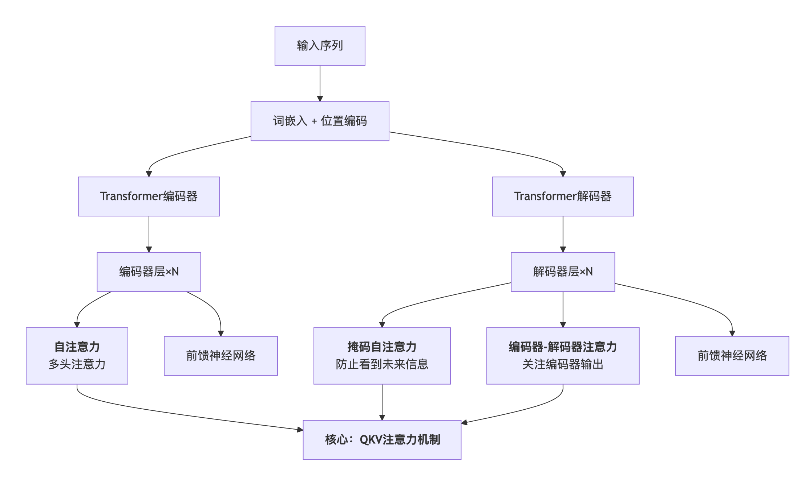

# Transformer-Attention
**注意力机制是Transformer架构的核心构件，而Transformer是建立在注意力机制（特别是自注意力）之上的一个完整模型架构。**

它们的关系可以这样概括：
- **注意力机制**：是一种**技术**或**组件**，就像汽车的"发动机"
- **Transformer**：是一个完整的**模型架构**，就像一辆"汽车"，它使用"发动机"（注意力机制）作为动力核心，但还包括底盘、车轮、方向盘等许多其他部件

让我详细分解这种关系：

## 1. 注意力机制是Transformer的"发动机"

在Transformer出现之前，注意力机制已经存在，主要用在**编码器-解码器架构**中，帮助解码器在生成每个词时"注意"编码器输出的不同部分。

**Transformer的革命性贡献**是提出了**自注意力（Self-Attention）**，并把它作为处理序列的**主要机制**，完全替代了RNN和CNN。



从上图可以看出，**注意力机制（特别是基于QKV的自注意力）是Transformer各个组件的核心运算**。

## 2. Transformer架构中的多种注意力形式

Transformer不仅仅使用了基本的注意力机制，还对其进行了扩展和组合：

### a) 编码器中的自注意力
- **作用**：让输入序列中的每个词都能关注序列中的所有其他词
- **示例**：在句子"The animal didn't cross the street because it was too tired"中，"it"可以通过自注意力直接与"animal"建立联系

### b) 解码器中的两种注意力：

#### 掩码自注意力
- **特殊之处**：添加了掩码，确保在生成第t个词时，只能关注前t-1个词（不能看到"未来"信息）
- **目的**：保持自回归特性，适用于生成任务

#### 编码器-解码器注意力
- **作用**：让解码器在生成每个词时，能够关注编码器的完整输出
- **Q、K、V的来源**：
  - **Q**来自解码器的上一层的输出
  - **K、V**来自编码器的最终输出

## 3. Transformer对注意力机制的创新

Transformer不仅仅是"使用"了注意力机制，还对它进行了重要发展：

### 创新1：缩放点积注意力（Scaled Dot-Product Attention）
```python
# 原始公式
Attention(Q, K, V) = softmax(QK^T / √d_k) V
```
这个缩放因子（√d_k）是Transformer的贡献，防止点积过大导致梯度消失。

### 创新2：多头注意力（Multi-Head Attention）
这是Transformer最关键的创新之一：
- 将Q、K、V投影到多个不同的子空间
- 在每个子空间中并行执行注意力计算
- 最后将结果拼接起来

```python
# 伪代码表示多头注意力
MultiHead(Q, K, V) = Concat(head₁, head₂, ..., head_h)W^O
where head_i = Attention(QW_i^Q, KW_i^K, VW_i^V)
```

**多头的好处**：允许模型同时关注来自不同表示子空间的信息（如语法、语义、指代等不同方面的关系）。

## 4. 注意力机制 vs. Transformer：一个完整对比

| 方面 | 注意力机制 | Transformer |
|------|------------|-------------|
| **定位** | 一种计算组件/技术 | 一个完整的神经网络架构 |
| **历史** | 2014年提出，用于机器翻译 | 2017年由Google在"Attention is All You Need"中提出 |
| **组成部分** | Q、K、V矩阵，点积，softmax等 | 编码器、解码器、嵌入层、位置编码、层归一化、前馈网络等 |
| **主要用途** | 增强序列建模中的信息流动 | 替代RNN/CNN，处理各种序列任务（翻译、生成、分类等） |
| **创新点** | 动态权重分配 | 基于纯注意力的序列建模、多头机制、位置编码等 |

## 5. 现实世界的比喻

为了更好地理解，想象建造一座现代建筑：

- **注意力机制** ≈ **钢筋混凝土技术**
  - 是一种基础建筑材料和技术
  - 可以用于各种建筑结构

- **Transformer** ≈ **一座完全用钢筋混凝土构建的摩天大楼**
  - 不仅使用了钢筋混凝土，还设计了完整的建筑蓝图
  - 包括地基、楼层结构、电梯系统、通风系统等
  - 代表了一种新的建筑哲学：完全信赖钢筋混凝土而不依赖传统的砖木结构

## 总结

**关系概括**：注意力机制是Transformer不可或缺的核心技术，而Transformer是展示注意力机制强大潜力的完整实现框架。没有注意力机制就没有Transformer，但Transformer的价值在于它展示了如何**纯粹依靠注意力机制**来构建强大的序列模型，从而引发了深度学习领域的革命。

这就是为什么我们现在说"Transformer模型"而不是"注意力模型"——因为Transformer代表了一整套基于注意力的架构设计，而不仅仅是注意力机制本身。